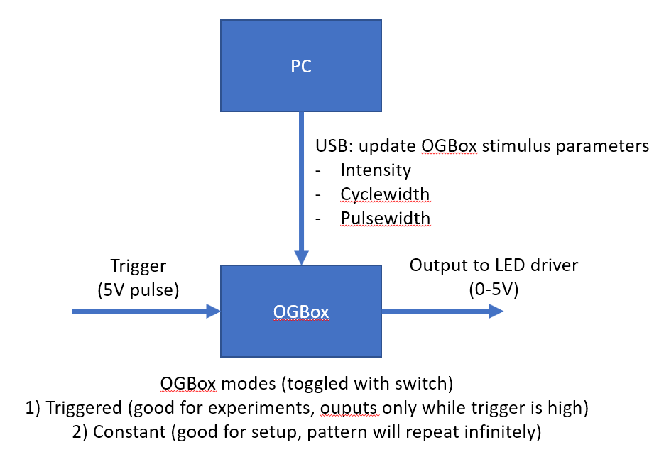

# ogbox

## Building

| Part  | Source |  Quantity |
| ------------- | ------------- |
| Arduino Micro  | https://www.digikey.com/en/products/detail/arduino/A000053/4486332  |  1  |
| MCP4725 12Bit DAC  | https://www.digikey.com/en/products/detail/adafruit-industries-llc/935/4990759 |  1  |
| Toggle switch  | https://www.digikey.com/en/products/detail/e-switch/100SP1T1B1M2QEH/378821  |  1  |
| Half sized solderless breadboard | https://www.digikey.com/en/products/detail/adafruit-industries-llc/64/7241427  |  1  |
| Female BNC leads | https://www.digikey.com/en/products/detail/pomona-electronics/4969/603340  |  2  |

