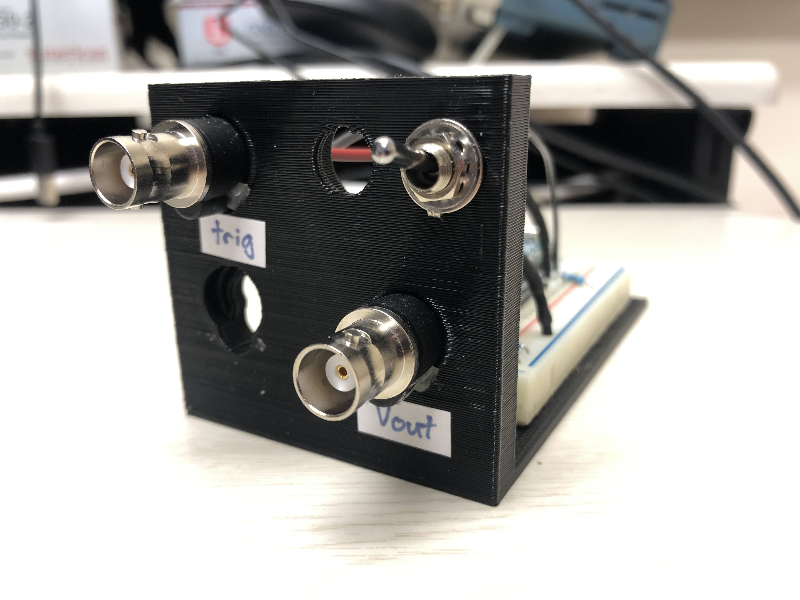
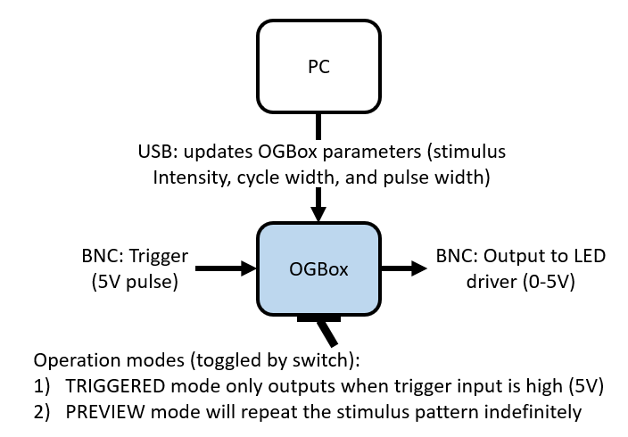

# ogbox
Pattern generator for optogenetic experiments. 

## Build instructions

1. Print case and assemble electronics based on wiring diagram.
2. Label the BNCs as "Trigger IN" and "Voltage OUT"
3. Connect the OGBox to computer via USB. Next, install the Adafruit_MCP4725 library by copying it from "firmware/libraries" to the Arduino "libraries" folder on your computer (on Windows this is C:Users\%USERNAME%\Documents\Arduino\libraries). Finally, compile and upload the firmware sketch (OGBox.ino) using the Arduino IDE.
4. You can verify that the OGBox is working correctly by connecting the output to an oscilloscope or LED driver and setting the toggle switch to PREVIEW mode. The default pattern should be a 1Hz pulse. (Note: if you don't see anything initially, the toggle switch might be set to TRIGGERED mode instead of PREVIEW mode).

| Part  | Source |  Quantity |
| ---  | --- |  --- |
| Arduino Micro  | https://www.digikey.com/en/products/detail/arduino/A000053/4486332  |  1  |
| MCP4725 12Bit DAC  | https://www.digikey.com/en/products/detail/adafruit-industries-llc/935/4990759 |  1  |
| Toggle switch  | https://www.digikey.com/en/products/detail/e-switch/100SP1T1B1M2QEH/378821  |  1  |
| Half sized solderless breadboard | https://www.digikey.com/en/products/detail/adafruit-industries-llc/64/7241427  |  1  |
| Female BNC leads | https://www.digikey.com/en/products/detail/pomona-electronics/4969/603340  |  2  |
| Case | 3D printed  |  1  |

## Integrating OGBox into setup

### Overview

### Step-by-step
1. The OGBox is used to operate [Thorlabs T-Cubes](https://www.thorlabs.com/newgrouppage9.cfm?objectgroup_id=2616) which are set to Modulation Mode (i.e., the cube output current exactly follows the amplitude and waveform of the voltage input signal independent from the knob setting). Connect the output of the OGBox to the T-Cube "MOD IN" with a BNC cable.
2. There are two different operation modes for the OGBox: TRIGGERED and PREVIEW modes. In TRIGGERED mode the OGBox will only output while the Trigger Input is high (5V). In PREVIEW mode, the stimulus pattern will repeat indefinitely.
3. The OGBox generates patterned waveforms based on three parameters: Intensity, Cyclelength, and Pulselength. These parameters are set via the USB connection with the Behavioral Control PC. The code in "matlab/demo.m" explains how to change OGBox parameters.
    - Intensity (ranges from 0-4095 and is proportional to maximum power output of the LED)
    - Cyclelength (time between pulses in milliseconds). Stimulus will be constant if set to 0.
    - Pulselength (length of each pulse in milliseconds). Stimulus will be constant if set to 0.
4. When the OGBox is in TRIGGERED Mode, it will only output a voltage pattern while the Trigger Input is high (5V). We use another Arduino to control the timing of all experimental components, so that provides the trigger signal for the OGBox.

